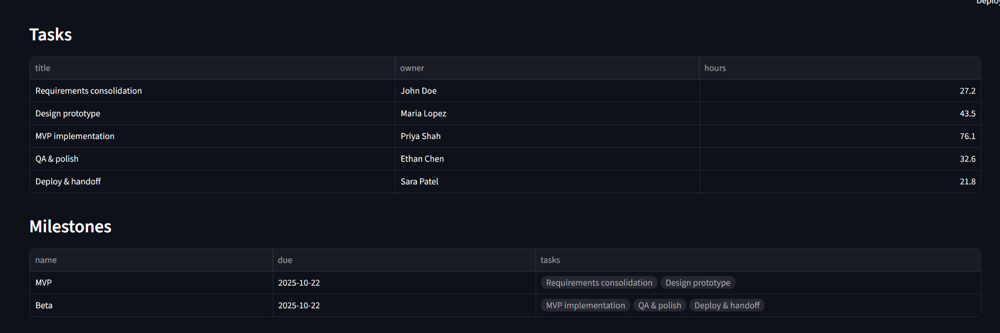
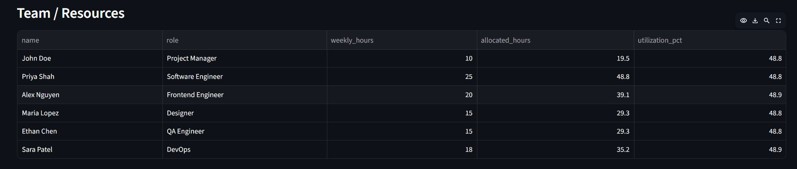

# 🧠 Product Project Planner  
**AI-powered multi-agent system for smarter project planning**

---

## 📘 Overview  
Product Project Planner is an **AI-assisted planning system** built with **Streamlit** and a modular **Python backend**.  
It turns plain-text project inputs — such as objectives, team members, and requirements — into structured, actionable project plans.

It estimates effort hours, assigns owners, and creates milestones — simulating how a real project manager would plan work.

---

## 🏗️ Features  
✅ **Dynamic Input Interface** – Describe your project in natural text.  
✅ **Role-Aware Effort Estimation** – Task hours depend on role, complexity, and team capacity.  
✅ **Team & Resource Allocation** – Distributes workload automatically by member capacity.  
✅ **Milestone Generator** – Groups tasks into MVP and Beta phases.  
✅ **Downloadable Outputs** – Export tasks and plans as JSON or CSV.  
✅ **Modular Architecture** – Clean separation between UI, parsers, role logic, and planner.

---

## 🗂️ Folder Structure
```
product_planner/
├── app.py                     # Streamlit UI
├── requirements.txt           # Dependencies
└── services/
    ├── __init__.py
    ├── parsers.py             # Team & requirement text parsing
    ├── roles.py               # Role normalization helpers
    └── planner.py             # Core planning logic (task, milestone, allocation)
```

---

## ⚙️ Installation

```bash
git clone https://github.com/yourusername/Product-Project-Planner.git
cd Product-Project-Planner
pip install -r requirements.txt
```

Then run:
```bash
streamlit run app.py
```

---

## 🧩 How It Works

### 1️⃣ Input Section
Provide project type, industry, objectives, team, and requirements.


### 2️⃣ Planning Logic
Each role gets work based on capacity, project complexity, and requirement size.




### 3️⃣ Download & Export
Export your generated project plan to JSON or CSV.


---

## 🧪 Example Input
```
Project Type: Website
Industry: E-commerce
Objectives: Develop an e-commerce site for small businesses
Team:
  - John Doe (Project Manager) [wh=10]
  - Priya Shah (Software Engineer) [wh=25]
  - Alex Nguyen (Frontend Engineer) [wh=20]
  - Maria Lopez (Designer) [wh=15]
  - Ethan Chen (QA Engineer) [wh=15]
  - Sara Patel (DevOps) [wh=18]

Requirements:
  - Responsive UI
  - Secure login & registration
  - Payment gateway integration
  - Admin dashboard
  - CI/CD deployment on AWS
```

---

## 💡 Future Enhancements
- Integrate LLM-based CrewAI orchestration  
- Add Gantt chart visualization  
- Export to Notion or Jira  
- Historical tracking of previous plans  

---

## 👨‍💻 Author
Developed by **Paritosh Gandre**  
*M.S. Data Science | Kent State University*  
📧 paritoshkrcg@gmail.com  
🔗 [LinkedIn](https://www.linkedin.com/in/paritosh-gandre-164b4a180/) | [GitHub](https://github.com/paritosh100)

