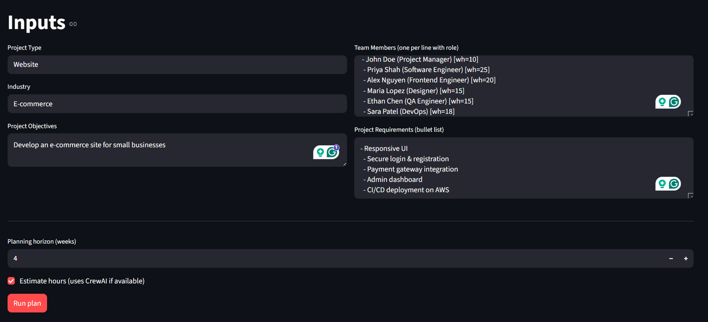

# 🤖 Multi-AI Agent Project Planner
### *Where AI Agents Collaborate to Plan Your Projects Like a Real Team*

[](https://www.python.org/)
[](https://streamlit.io/)
[](https://www.crewai.com/)
[](https://openai.com/)

---

## 🎯 What is This?

Imagine having a **team of AI specialists** working together to plan your next project — just like a real project management team would! This application uses multiple AI agents that collaborate to:

- 📝 **Break down** your project into actionable tasks
- ⏱️ **Estimate** realistic time requirements
- 👥 **Allocate** work based on your team's capacity
- 🎯 **Create** smart milestones and timelines

All you need to do is describe your project in plain English, and the AI agents do the rest!

---

## ✨ Why AI Agents? The Power of Collaborative Intelligence

### 🤔 Traditional Approach (Static Code)

Traditional project planning tools follow **rigid, pre-programmed rules**:

```
IF project_type == "Website" THEN
    tasks = ["Design", "Development", "Testing"]
    hours = [10, 30, 20]  # Fixed numbers
```

**Limitations:**
- ❌ Same generic tasks for every project
- ❌ Fixed time estimates regardless of complexity
- ❌ Cannot adapt to your specific requirements
- ❌ No understanding of context or nuances
- ❌ One-size-fits-all approach

### 🚀 Agentic Approach (AI Collaboration)

Our multi-agent system uses **specialized AI agents** that work together like a real team:

```
Agent 1 (Planner):     "Based on the requirements, here are 12 specific tasks..."
Agent 2 (Estimator):   "Given the team's experience, Task 1 needs 8.5 hours..."
Agent 3 (Allocator):   "Alice can handle this, Bob should focus on UI..."
```

**Advantages:**
- ✅ **Context-Aware**: Understands your industry, objectives, and constraints
- ✅ **Adaptive**: Different output for healthcare vs. e-commerce projects
- ✅ **Intelligent**: Considers team capacity, skills, and project complexity
- ✅ **Collaborative**: Agents refine each other's work, like real teammates
- ✅ **Dynamic**: Learns from patterns in millions of real projects

---

## 🎭 Meet Your AI Team

When you activate CrewAI mode, three specialized AI agents collaborate on your project:

### 🧠 Agent 1: The Project Planner
**Role**: Strategic Planner  
**Responsibility**: Breaks down your project into specific, actionable tasks

*"Looking at your e-commerce requirements, I'll create tasks for product catalog, payment integration, user authentication, and admin dashboard..."*

### 📊 Agent 2: The Effort Estimator
**Role**: Technical Analyst  
**Responsibility**: Estimates realistic hours based on complexity and team capacity

*"Considering your team has 2 developers with 40 hours/week over 4 weeks, the payment integration will need approximately 16 hours..."*

### 📅 Agent 3: The Resource Allocator
**Role**: Project Coordinator  
**Responsibility**: Creates milestones and allocates work efficiently

*"I'll assign UI tasks to your designer, backend work to the senior dev, and create MVP and Beta milestones with realistic deadlines..."*

---

## 🖼️ See It In Action

### Step 1: Describe Your Project
Simply fill in what you're building, who's on your team, and what you need:



**Non-Tech Translation**: Just type in plain English — no technical jargon needed! Tell us about your project like you'd explain it to a colleague.

---

### Step 2: Activate AI Agents
Check the **"Estimate hours"** box to activate the AI team:


**What Happens Behind the Scenes**:
1. 🤖 Three AI agents start collaborating
2. 💬 They discuss your project (like a real team meeting)
3. 📊 Each agent adds their expertise
4. ✨ They produce a comprehensive plan

---

### Step 3: Get Your Intelligent Plan
Receive detailed tasks with smart estimates and realistic timelines:


**The Magic**: Notice how each task has:
- 🎯 Specific, actionable titles (not generic!)
- 👤 Assigned to the right team member
- ⏱️ Realistic hour estimates based on your team's capacity
- 📅 Milestones distributed across your timeline

---

### Step 4: Download and Use
Export your plan as JSON or CSV for use in your favorite tools:


---

## 🔄 Real Example: Same Input, Different Intelligence

### Input
```
Project Type: E-commerce Website
Industry: Retail
Team: 2 developers (40h/week), 1 designer (20h/week)
Timeline: 4 weeks
Requirements: Product catalog, Shopping cart, Payment integration, Admin dashboard
```

### 📊 Traditional Code Output (Fallback Mode)
```
Tasks:
1. Scope & plan
2. Design prototype  
3. Build MVP
4. QA & release

(Same 4 tasks for EVERY project, no matter what!)
```

### 🤖 AI Agent Output (CrewAI Mode)
```
Tasks:
1. Design product catalog UI mockups - Designer (12 hours)
2. Implement product database schema - Developer A (8 hours)
3. Build product listing page with filters - Developer A (18 hours)
4. Create shopping cart functionality - Developer B (16 hours)
5. Integrate Stripe payment gateway - Developer B (14 hours)
6. Develop admin product management - Developer A (20 hours)
7. Design responsive checkout flow - Designer (10 hours)
8. Implement admin dashboard - Developer B (15 hours)
9. Add order tracking system - Developer A (12 hours)
10. Conduct security testing - Team (8 hours)

Milestones:
- MVP (Week 2): Product catalog + Shopping cart
- Beta (Week 4): Full checkout + Admin panel
```

**See the Difference?**
- 🎯 Specific to YOUR requirements
- 👥 Matched to YOUR team's skills
- ⏱️ Realistic hours for YOUR timeline
- 📊 Intelligent breakdown, not generic templates

---

## 🏗️ How It Works (Simple Explanation)

### Traditional Programming:
```
You Input → Fixed Rules → Generic Output
```

### AI Agent Approach:
```
You Input → AI Team Discussion → Custom Plan
             ↓
    Agent 1: "Here are specific tasks..."
    Agent 2: "Based on complexity, here are hours..."
    Agent 3: "Optimized allocation and milestones..."
```

Think of it like:
- **Old Way**: Using a calculator that only knows 2+2=4
- **New Way**: Having a team of mathematicians who can solve any equation

---

## 🚀 Quick Start

### 1. Installation

```bash
# Clone the repository
git clone https://github.com/yourusername/multi-ai-agent-planner.git
cd multi-ai-agent-planner

# Install dependencies
pip install -r requirements.txt
```

### 2. Setup Your AI Team

Create a `.env` file in the project root:

```bash
# Get your API key from: https://platform.openai.com/api-keys
OPENAI_API_KEY=sk-your-key-here
OPENAI_MODEL=gpt-4o-mini
```

### 3. Launch the Application

```bash
streamlit run streamlit_app.py
```

### 4. Use It!

1. 📝 Fill in your project details
2. ✅ **Check "Estimate hours"** to activate AI agents
3. 🚀 Click "Run plan"
4. 📊 Get your intelligent project plan!

**Look for the indicator**: 🧠 **CrewAI Active** means your AI team is working!

---

## 💡 When to Use Each Mode

### ⚙️ Fallback Mode (No AI Agents)
**Use when:**
- You just need a quick template
- No API key available
- Want a simple starting point

**What you get:**
- Basic task structure
- Generic assignments
- Quick results

### 🧠 CrewAI Mode (AI Agents Active)
**Use when:**
- You need a detailed, realistic plan
- Project is complex or specific
- Want intelligent hour estimates
- Need proper resource allocation

**What you get:**
- Context-aware task breakdown
- Realistic time estimates
- Smart team allocation
- Professional-grade planning

---

## 📦 Project Structure

```
multi-ai-agent-deep/
├── streamlit_app.py           # Main UI - Your control panel
├── requirements.txt           # All dependencies
├── .env                       # Your API key (create this!)
├── services/
│   ├── planner.py            # Orchestrates AI agents
│   ├── crew_runner.py        # AI agent definitions
│   ├── parsers.py            # Understands your input
│   └── config/
│       ├── agents.yaml       # Agent configurations
│       └── tasks.yaml        # Task templates
└── img/                      # Screenshots for docs
```

---

## 🎓 Real-World Use Cases

### 1. 🏢 Startup MVP Planning
"We need to launch in 6 weeks with 3 developers"
→ AI agents create a realistic roadmap with priorities

### 2. 🏥 Healthcare Portal
"HIPAA-compliant patient portal with specific security requirements"
→ AI understands compliance needs and adds security tasks

### 3. 📱 Mobile App Launch
"iOS and Android app with limited designer availability"
→ AI balances workload across platforms and team constraints

### 4. 🛒 E-commerce Migration
"Migrating from Shopify to custom solution"
→ AI includes migration-specific tasks and data handling

---

## 🆚 Comparison Table

| Feature | Traditional Code | AI Agents |
|---------|-----------------|-----------|
| Task Generation | Fixed templates | Context-specific |
| Time Estimates | Generic numbers | Intelligent calculation |
| Adaptability | Rigid rules | Learns from context |
| Complexity Handling | Same for all | Scales with project |
| Team Consideration | Basic assignment | Skill & capacity aware |
| Industry Knowledge | None | Trained on thousands |
| Output Quality | Template-based | Professional-grade |
| Learning Ability | Never improves | Gets smarter |

---

## ⚙️ Configuration

### Switching AI Models

In your `.env` file:

```bash
# For faster results (cheaper)
OPENAI_MODEL=gpt-3.5-turbo

# For better quality (recommended)
OPENAI_MODEL=gpt-4o-mini

# For best results (more expensive)
OPENAI_MODEL=gpt-4o
```

### Cost Estimates

Approximate cost per project plan:
- **gpt-3.5-turbo**: $0.01 - $0.03 per plan
- **gpt-4o-mini**: $0.05 - $0.15 per plan (⭐ recommended)
- **gpt-4o**: $0.30 - $1.00 per plan

*Note: The intelligence you get is worth far more than the pennies it costs!*

---

## 🔍 Troubleshooting

### ❓ "Still seeing Fallback Mode"
**Solution:**
1. ✅ Check "Estimate hours" checkbox in the UI
2. ✅ Verify `.env` file has valid API key
3. ✅ Restart Streamlit after creating `.env`
4. ✅ Look for "🔐 API key loaded: yes"

### ❓ "API Key Error"
**Solution:**
- Get a valid key from: https://platform.openai.com/api-keys
- Ensure it starts with `sk-`
- Check your OpenAI account has credits

### ❓ "Slow Response"
**Solution:**
- AI agents are thinking! Takes 15-30 seconds
- Switch to faster model: `OPENAI_MODEL=gpt-3.5-turbo`
- This is 3 AI agents collaborating - worth the wait!

---

## 📚 Documentation

- 📖 **[Quick Start Guide](QUICK_START.md)** - Get running in 5 minutes
- 🔧 **[Integration Guide](CREWAI_INTEGRATION_GUIDE.md)** - Deep dive into AI setup
- 📊 **[Technical Summary](SUMMARY.md)** - Architecture and fixes

---

## 🎯 Why This Matters

### The Future of Software is Agentic

This project demonstrates the **shift from programming to orchestrating**:

**Yesterday**: Write code for every scenario  
**Today**: Design AI agents that think and collaborate  
**Tomorrow**: AI teams handle entire projects autonomously

**You're seeing the future of project management** — where AI agents work together like human teams, but with:
- 📚 Knowledge from millions of projects
- ⚡ Instant analysis and planning
- 🎯 Zero bias or fatigue
- 💰 Available 24/7 at pennies per plan

---

## 🤝 Contributing

This is an educational project demonstrating multi-agent AI systems. Contributions welcome!

**Ideas for Enhancement:**
- 📊 Add Gantt chart visualization
- 🔗 Export to Jira/Asana/Notion
- 🤖 Add more specialized agents (Risk Analyst, Cost Estimator)
- 🌍 Multi-language support
- 📈 Historical project tracking

---

## 👨‍💻 Author

**Paritosh Gandre**  
*M.S. Data Science | Kent State University*  

📧 paritoshkrcg@gmail.com  
🔗 [LinkedIn](https://www.linkedin.com/in/paritosh-gandre-164b4a180/) | [GitHub](https://github.com/paritosh100)

---

## 📄 License

This project is open source and available for educational purposes.

---

## 🌟 Star This Repo!

If this project helped you understand AI agents or plan a project better, give it a ⭐!

---

## 🙏 Acknowledgments

Built with:
- 🤖 **CrewAI** - For the multi-agent framework
- 🧠 **OpenAI GPT-4** - For the AI intelligence
- 🎨 **Streamlit** - For the beautiful UI
- 💜 **Python** - For making it all possible

---

<div align="center">

### 🚀 Ready to Experience AI-Powered Planning?

**[Get Started Now](QUICK_START.md)** | **[See Examples](examples/)** | **[Report Issues](issues/)**

---

*Made with ❤️ and 🤖 by humans and AI agents working together*

</div>
